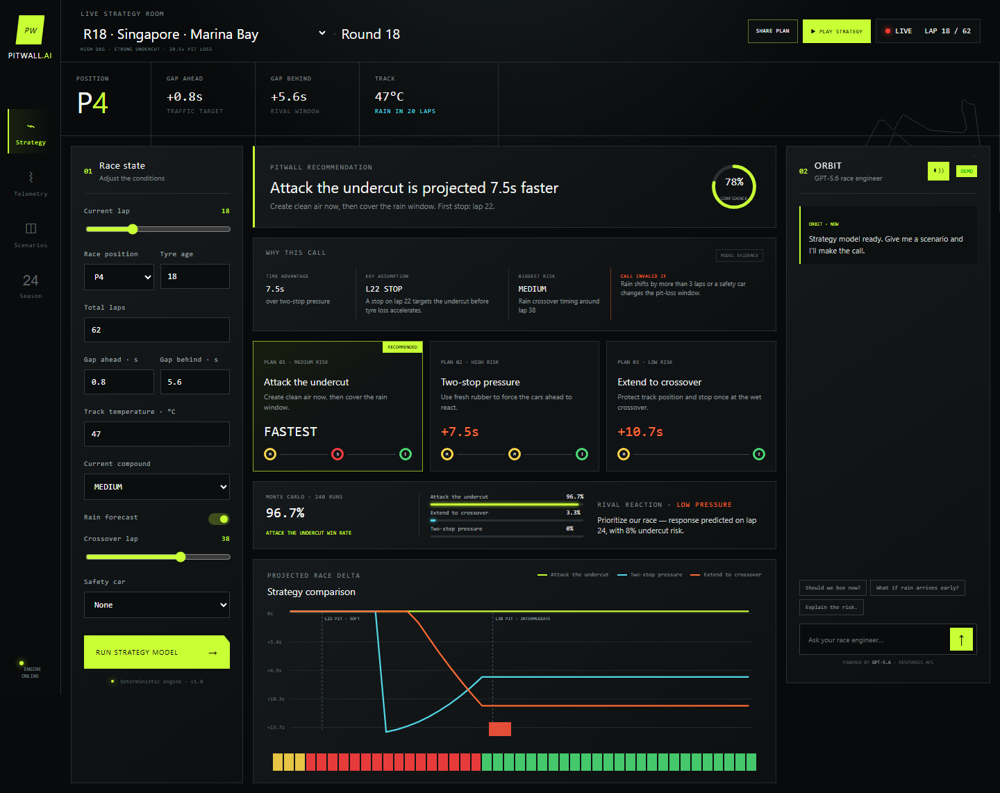
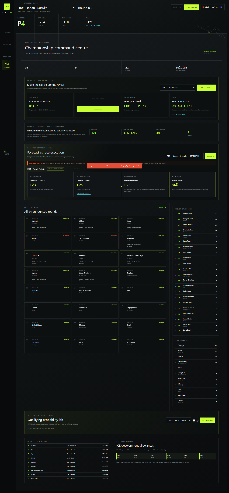

# PitWall AI

> Explainable Formula racing strategy, calculated by a deterministic simulator and investigated by a tool-using GPT-5.6 race engineer.

[](https://www.python.org/)
[](https://fastapi.tiangolo.com/)
[](https://developers.openai.com/api/)
[](LICENSE)

PitWall AI is an interactive strategy room for fans who want to understand *why* a race call works. Change the circuit, position, tyre age, track temperature, gaps, weather, or safety-car timing; PitWall simulates competing plans lap by lap, stress-tests the result, and lets ORBIT investigate the evidence with tools before making a radio call.

Built as a solo submission for [OpenAI Build Week 2026](https://openai.devpost.com/).



## Why PitWall

Race strategy is hard to follow because tyre degradation, fuel effect, traffic, pit loss, weather, and rival reactions change simultaneously. Broadcasts usually show the decision, not the counterfactual.

PitWall makes those invisible trade-offs explorable:

1. Configure a race state.
2. Simulate three competing strategies.
3. Inspect the time delta, stop window, risks, and invalidation condition.
4. Ask ORBIT to run tools and explain the call.
5. Replay the projected strategy or compare it with historical execution.

## Highlights

- Deterministic, lap-by-lap strategy engine with tyre degradation, fuel effect, traffic, pit loss, weather, safety cars, position, temperature, and circuit characteristics.
- Three counterfactual plans ranked by projected race time.
- Seeded 240-run Monte Carlo stress test with win probabilities, downside, and rival-response modeling.
- Tool-using ORBIT agent powered by GPT-5.6 and the Responses API.
- Visible ORBIT tool trace for simulation, uncertainty analysis, and historical validation.
- Live Strategy Room coverage for all 24 announced 2026 rounds.
- Accurate current-layout circuit vectors for all 24 venues with CC BY 4.0 attribution.
- Adjustable P1-P22 position, gaps, tyre state, track temperature, weather, and safety-car timing.
- Animated strategy replay with real-time, 10x, 30x, and 60x playback.
- Shareable URLs that preserve the complete race state.
- 2026 Season Hub with calendar, drivers, teams, winners, fastest laps, qualifying simulation, and energy-strategy context.
- Blinded historical challenge: lock the baseline call before revealing official execution.
- Honest validation scorecard with coverage, mean stop-lap error, hit rate, and source gaps.
- Fully functional deterministic demo mode when no OpenAI API key is configured.

## ORBIT is an agent, not a chat wrapper

GPT-5.6 does not invent lap times or select from imaginary telemetry. It receives the user's question and race state, then uses bounded application tools:

```text
User question + race state
            |
            v
      GPT-5.6 ORBIT agent
       /        |        \
      v         v         v
 strategy   uncertainty  historical
 simulator   stress test  validator
      \         |         /
       \        |        /
        grounded radio call
        + visible tool trace
```

The Python engine owns numerical outcomes. GPT-5.6 chooses analytical tools, compares their structured results, communicates the trade-off, and states what would invalidate the recommendation.

## Historical validation



Round status and results are fetched live from OpenF1 on every request, falling back to a bundled snapshot dated **2026-07-14** only if OpenF1 is unreachable for a given round -- so the app stays functional offline, per the "fully functional deterministic demo mode" behavior above. Historical strategies are explicitly labeled **retrospective baselines**; they are not presented as predictions frozen before each race.

Bundled fallback scorecard (used only when live data is unavailable):

- 9 completed rounds represented.
- 8 rounds validated against captured official winner pit execution.
- 1 explicit source gap: Austria.
- 4.12-lap mean absolute first-stop error.
- 50% pit-window hit rate.

The live coverage and hit rate grow as more rounds complete; this fallback scorecard is a floor, not the app's current state.

Actual execution is excluded from model inputs and is used only in the comparison layer. Imperfect results remain visible.

## Architecture

```text
Browser UI (vanilla HTML/CSS/JS)
              |
              v
        FastAPI application
       /        |         \
      v         v          v
 strategy    season      ORBIT agent
 engine      snapshot    Responses API
      |         |          |
      +---- structured evidence ----+
```

The same FastAPI service serves both the frontend and API, which keeps local and Railway deployment simple and avoids cross-origin configuration.

## Run locally

Requirements: Python 3.11 or newer.

### Windows PowerShell

```powershell
git clone <your-repository-url>
cd pitwall-ai
python -m venv .venv
.venv\Scripts\Activate.ps1
pip install -r requirements.txt
Copy-Item .env.example .env
python run.py
```

### macOS or Linux

```bash
git clone <your-repository-url>
cd pitwall-ai
python3 -m venv .venv
source .venv/bin/activate
pip install -r requirements.txt
cp .env.example .env
python run.py
```

Open [http://localhost:8765](http://localhost:8765).

Without an API key, every simulator feature works and ORBIT returns deterministic demo calls. To enable the live agent, edit `.env`:

```env
OPENAI_API_KEY=your_secret_api_key
OPENAI_MODEL=gpt-5.6
```

Never commit `.env` or expose an API key in frontend code.

## Deploy on Railway

PitWall should be deployed as **one Railway service**. FastAPI already serves the static frontend, so a separate Vercel frontend is unnecessary.

1. Push this directory to a public GitHub repository.
2. In Railway, choose **New Project > Deploy from GitHub repo**.
3. Select the PitWall repository.
4. Add these Railway variables:

   ```text
   OPENAI_API_KEY=your_secret_api_key
   OPENAI_MODEL=gpt-5.6
   ```

5. Generate a public Railway domain.
6. Verify `/api/health`, `/docs`, and the main application.

Railway uses the included [`Dockerfile`](Dockerfile) and [`railway.toml`](railway.toml). The service starts with:

```bash
uvicorn app.main:app --host 0.0.0.0 --port $PORT
```

The [`Procfile`](Procfile) is retained as a compatible fallback for platforms that support it.

## API

| Method | Endpoint | Purpose |
|---|---|---|
| `GET` | `/api/health` | Service readiness |
| `POST` | `/api/simulate` | Calculate and rank strategy plans |
| `POST` | `/api/monte-carlo` | Stress-test plans and model rival response |
| `POST` | `/api/engineer` | Run the ORBIT strategy agent |
| `GET` | `/api/season/2026` | Dated season snapshot with source URLs |
| `GET` | `/api/qualifying` | Seeded qualifying Monte Carlo estimate |
| `GET` | `/api/strategy/rounds` | All-round strategy profiles and provenance |
| `GET` | `/api/strategy/backtest/{round}` | Baseline, actual, counterfactual, and validation |
| `GET` | `/api/strategy/validation` | Aggregate validation metrics and disclosure |
| `GET` | `/docs` | Interactive OpenAPI documentation |

## Test

```bash
pytest -q
```

The suite covers strategy ranking, weather and safety-car behavior, circuit physics, all 24 live circuits, position effects, temperature and gap effects, Monte Carlo reproducibility, qualifying, ORBIT tool handlers, season provenance, and validation metrics.

## Project structure

```text
pitwall-ai/
|-- app/
|   |-- main.py          # FastAPI routes
|   |-- engine.py        # deterministic strategy and Monte Carlo engine
|   |-- ai_engineer.py   # GPT-5.6 tool loop and ORBIT prompt
|   |-- season.py        # dated season data and validation layer
|   `-- models.py        # validated request/response models
|-- static/              # dependency-light browser application
|-- tests/               # automated engine and agent-tool tests
|-- docs/                # repository screenshots
|-- Dockerfile
|-- railway.toml
|-- Procfile
`-- requirements.txt
```

## Scope and safety

PitWall is an independent educational motorsport simulation. It is not affiliated with Formula 1, the FIA, any promoter, constructor, or racing team. It does not consume private telemetry and must not be treated as a professional race-engineering system.

Circuit, tyre, traffic, energy, and weather behavior are educational approximations. Public facts and model estimates are labeled separately in the interface.

## Data and attribution

- Current-layout circuit geometry is derived from [F1DB circuit SVG assets](https://github.com/f1db/f1db/tree/main/src/assets/circuits), created by Jules Roy and distributed under CC BY 4.0.
- Published season results and pit summaries link back to their Formula 1 source pages in the application.
- FIA regulatory thresholds link to their published source.

See [`THIRD_PARTY_NOTICES.md`](THIRD_PARTY_NOTICES.md) for attribution details.

## License

PitWall AI application code is available under the [MIT License](LICENSE). Third-party circuit geometry remains subject to its CC BY 4.0 terms.
